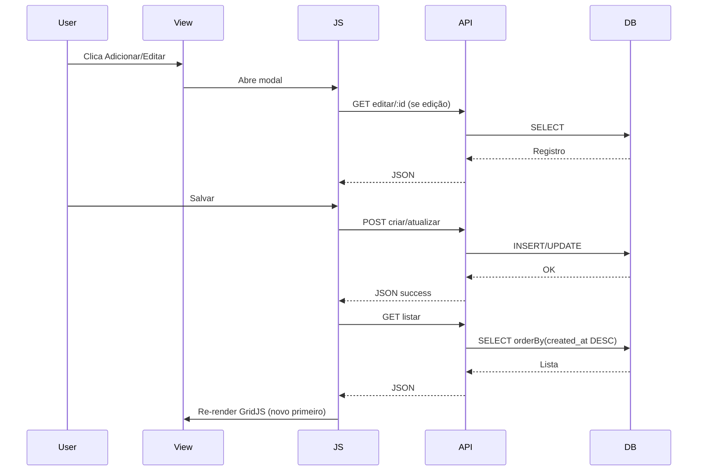

# Produtos e Serviços: CRUD dinâmico (banco)

## Objetivo

- Remover mocks de `produtos.js` e `servicos.js`
- Carregar dados reais do banco (tabelas `produtos` e `servicos`)
- Implementar **modal de cadastro/edição** e **atualização do GridJS** após salvar
- Ordenação: **último cadastrado primeiro** (`created_at DESC`)
- Adicionar botão **Editar** com ícone na listagem
- Usar `*_empresa_id = 1` (fixo, como Veículos)
- Melhorias de UX (padrão Veículos):
  - Enter avança campo a campo no modal (Shift+Enter volta)
  - Inputs com cor de texto mais forte (mais escuro) para melhor leitura
  - Bootstrap Modal inicializado de forma lazy (evita dependência de ordem de scripts)
  - Ordem de scripts: dados iniciais `window.__*__` antes do `*.js` da página

## Tabelas (SQL)

- **`produtos`**: `pro_empresa_id`, `pro_nome`, `pro_categoria`, `pro_marca`, `pro_sku`, `pro_preco_custo`, `pro_preco_venda`, `pro_estoque_atual`, `pro_estoque_minimo`, `pro_controlado`, `pro_intervalo_km`, `pro_ativo` (+ timestamps)
- **`servicos`**: `ser_empresa_id`, `ser_nome`, `ser_categoria`, `ser_descricao`, `ser_preco_padrao`, `ser_controlado`, `ser_intervalo_km`, `ser_ativo` (+ timestamps)

## Arquivos a criar/alterar

### 1) Models

- Criar [`app/Models/ProdutoModel.php`](app/Models/ProdutoModel.php)
- Criar [`app/Models/ServicoModel.php`](app/Models/ServicoModel.php)
- Definir `$allowedFields` conforme colunas `pro_*` e `ser_*` e `useTimestamps = true`

### 2) Controllers

- Alterar [`app/Controllers/Produtos.php`](app/Controllers/Produtos.php):
  - `index()` busca produtos `orderBy(created_at, DESC)` e passa `produtos` para view (primeira renderização)
  - Endpoints JSON:
    - `listar()` GET
    - `editar($id)` GET
    - `criar()` POST
    - `atualizar($id)` POST
  - `pro_empresa_id = 1`

- Alterar [`app/Controllers/Servicos.php`](app/Controllers/Servicos.php):
  - Mesmo padrão (`ser_empresa_id = 1`)

### 3) Rotas

Alterar [`app/Config/Routes.php`](app/Config/Routes.php):

- Produtos:
  - `admin/cadastro/produtos/listar`
  - `admin/cadastro/produtos/criar`
  - `admin/cadastro/produtos/editar/(:num)`
  - `admin/cadastro/produtos/atualizar/(:num)`
- Serviços:
  - `admin/cadastro/servicos/listar`
  - `admin/cadastro/servicos/criar`
  - `admin/cadastro/servicos/editar/(:num)`
  - `admin/cadastro/servicos/atualizar/(:num)`

### 4) Views (modais)

Alterar:

- [`app/Views/admin/produtos/index.php`](app/Views/admin/produtos/index.php)
- [`app/Views/admin/servicos/index.php`](app/Views/admin/servicos/index.php)

Adicionar:

- Botão "Adicionar" com `id` (ex: `btn-add-produto`, `btn-add-servico`)
- Modal Bootstrap `#modalProduto` e `#modalServico` com campos essenciais (clean):
  - **Produto**: Nome*, Categoria, Marca, SKU, Preço venda*, Estoque atual, Estoque mínimo, Status (Ativo/Inativo)
  - **Serviço**: Nome*, Categoria, Preço padrão*, Status (Ativo/Inativo)
- “Ver mais” dentro do modal para campos extras (opcional): descrição, preço custo, controlado/intervalo
- UX adicional nos modais:
  - Enter para avançar nos campos (JS)
  - Texto dos inputs/selects mais escuro via CSS (ex.: `color: #111827`)
  - IDs de botões e alertas para feedback (spinner no botão salvar, mensagens)

### 5) JavaScript (GridJS + AJAX)

Alterar:

- [`public/assets/admin/js/pages/produtos.js`](public/assets/admin/js/pages/produtos.js)
- [`public/assets/admin/js/pages/servicos.js`](public/assets/admin/js/pages/servicos.js)

Implementar:

- Remover arrays mockados
- Consumir endpoints `/listar` para carregar a tabela
- Coluna **Ações** com botão **Editar** (ícone `iconamoon:edit-duotone`)
- Submit do modal:
  - POST `/criar` ou `/atualizar/:id`
  - Em sucesso: fechar modal, recarregar grid (mantendo ordenação `created_at DESC`)
- Máscara monetária (mesmo padrão do Financeiro com jQuery Mask) para `preco_*`
- UX AJAX: desabilitar botão salvar + spinner, restaurar ao finalizar
- Enter navigation no modal (igual Veículos): não submeter no Enter, apenas focar próximo input/select
- Garantir que o Grid nunca fique vazio por ordem de script:
  - Render inicial com `window.__PRODUTOS__`/`window.__SERVICOS__`
  - Se vier vazio, chamar `/listar` no load

## Fluxo

## Entregáveis

- Produtos e Serviços com dados 100% do banco
- Cadastro/edição por modal
- Grid atualizado automaticamente
- Ação de editar na tabela